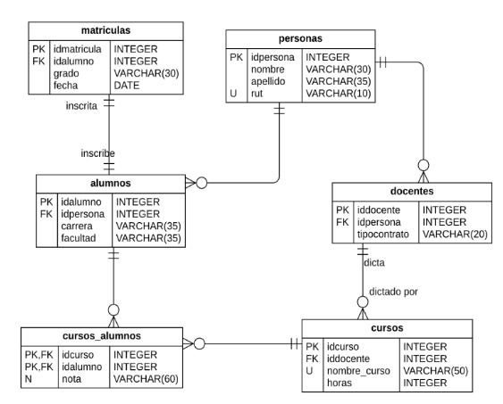
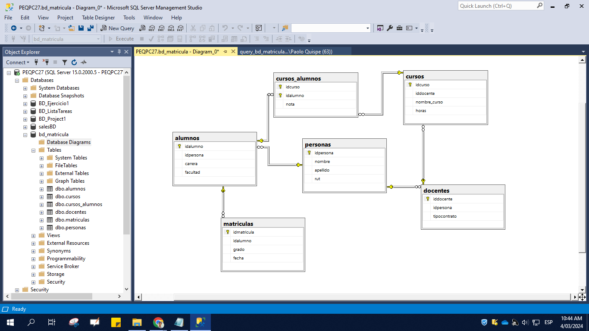

# bd_matricula
Creación de una base de datos simple realizada en SEL SERVER para el registro de matrículas. Dejo Query y Readme para la documentación respectiva
## Diagrama de base de datos a realizar: 
A continuación se muestra el modelo físico de la base de datos.

## Diagrama de base de datos realizado en SQL SERVER: 
La query para la creación de tablas está en este repositorio, se hizo claves primarias compuestas, claves foraneas segun la relación que establce el diagrama.

